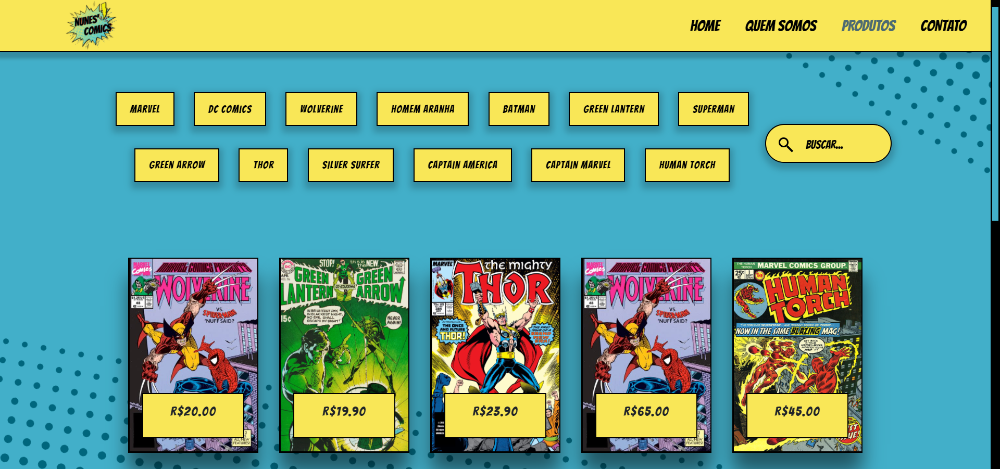

<h1 align="center">
  
</h1>

<h2 align="center">
    
</h2>

---

<h2>📋 Índice</h2>

<ul>
    <li><a href="#about">📖 Sobre</a></li>
    <li><a href="#repository">👨‍🏫 Uso do repositório</a></li>
    <li><a href="#run">🏭 Rodando o servidor</a></li>
    <!-- <li><a href="#preview">🔍 Preview</a></li> -->
</ul>

---

<h2 id="about">📖 Nunes' Comics</h2>

Projeto desenvolvido para o Trainee da [Code Jr](https://codejr.com.br/). Consiste em uma loja de quadrinhos.
- Desenvolvimento:
  - Front-end: HTML, CSS e JavaScript
  - Back-end: PHP e SQL

### Projeto Trainee, Code Jr, Grupo 2, 2021.1

Desenvolvedores:
- Gabriel Frasson
- Gabriel Magalhães
- Mara Lemos
- Pedroenrick
- Sabrina Costa

Scrum Master:

- [Renan Nunes](https://renannun.github.io/)

---

<h2 id="repository">👨‍🏫 Tutorial de uso do repositório</h2>

### Primeira utilização

- Entre na pasta onde irá guardar o projeto: `cd /caminho/para/a/pasta`
- Clone o repositório: `git clone https://github.com/renanNun/nunes-comics.git`
- Entre na pasta criada pelo comando clone: ``cd nunes-comics``
- Crie sua branch usando como o padrão o nome da feature que você está a desenvolver
- Exemplo de criação de branch de uma view do painel administrativo
  - Crie a branch da funcionalidade a ser implementada: `git checkout -b view-painel-adm`
  - Envie a sua branch para o repositório remoto do github: `git push origin view-painel-adm`

### Rotina

- Cheque em qual branch está e quais alterações foram adicionadas: git status
- Certifique-se de estar na sua branch usando: `git status`
  - Se não estiver na sua branch, vole para ela: `git checkout suabranch`
- Adicione as alterações feitas na sua branch: `git add .`
- Dê um commit com uma mensagem especificando as alterações realizadas: `git commit -m "mensagem especificando o que foi feito"`
- Envie o commit feito para sua branch no GitHub: `git push origin suabranch`

### Ao final da sprint, estando tudo certo, faça o merge

- Espere a confirmação do seu SCRUM para fazer o Merge
- Depois de solicitado pelo Scrum Master, faça o merge entre sua branch e a main:
- Certifique-se de estar na sua branch usando: `git status`
  - Se não estiver na sua branch, vole para ela: `git checkout suabranch`
- Mescle o conteúdo da main na sua branch: `git merge main`
- Confirme o merge enviando para o servidor do GitHub: `git push origin suabranch`
- Vá para a main: `git checkout main`
- Atualize a main: `git pull`
- Faça o merge das alterações de sua branch com a main: `git merge suabranch`

---

<h2 id="run">🏭 Rodando o servidor</h3>

- Para visualizar o projeto, utilizar o comando `php -S localhost:8080` no terminal (é necessário possuir XAMPP ativado)

---

<!-- <h2 id="preview">🔍 Preview</h2> -->
